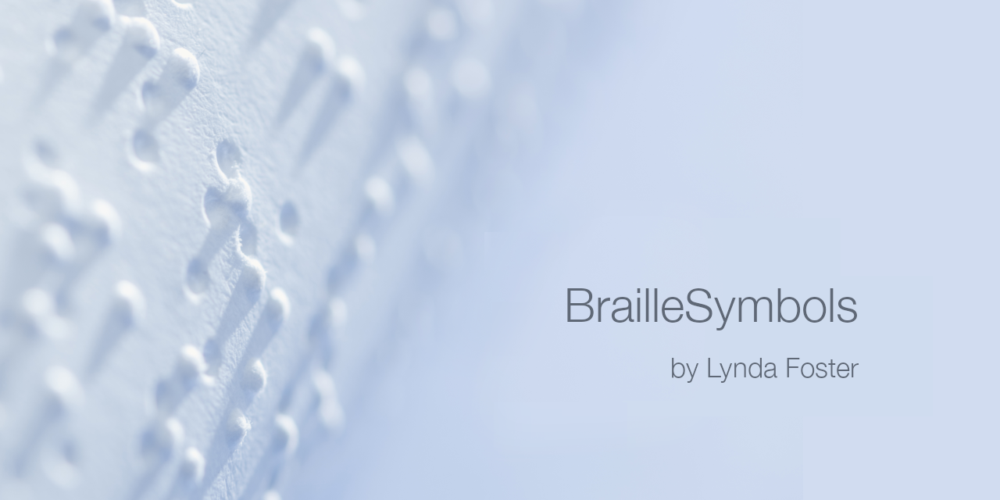

# BrailleSymbols

The list of braille 'special symbols' is defined by committee and published in html format - https://iceb.org/symbsc2.html. This project consists of an API that makes the information accessible, searchable, and maintainable. 

This will be part of a tool that will help transcribers format the Special Symbols Page in Braille transcriptions. It's also a piece of a braille training ecosystem I am designing. 

## WALKTHROUGH
An administrative dashboard for maintaining a database of braille special symbols. Designed, tested, and deployed following Open API Specification standards using Swagger. 

## OPEN REQUIREMENTS

MVP 
- Consumed by a web app that allows authenticated users can search, create, update, and delete records from the Special Symbols database through the BrailleSymbolsAPI. 
- Unauthenticated users can search the database to locate symbols. 
- FosterPi API provides authentication using Linkedin OAuth 2.0. 

PLANNED UPDATES
- Create a service that scrapes symbols from the ICEB database
- Create a service that adds unique symbols to the database
- Create a service that sorts symbols into ascii-braille order
- Provide an option to export sorted symbols as a csv file.

## LOGIC DESIGN
BrailleSymbolsAPI provides access to the database.
FosterPi API provides authentication to limit who can access and modify the database.

## DATA DESIGN
SpecialSymbolsModel - ascii, name, added, updated

